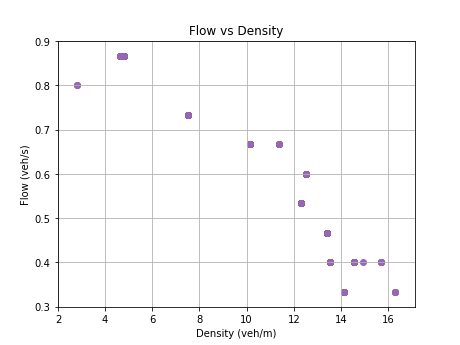
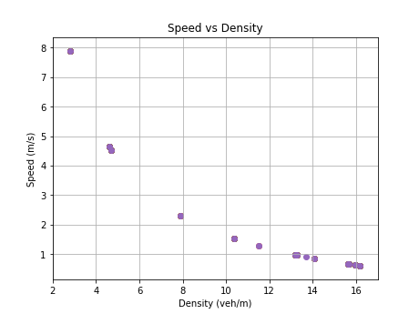

# Car following simulation

>📋  A reproducible project example featuring traffic simulation with car following models and fundamental diagrams.

# My Paper Title

This repository is the official implementation for the ITSC 2024 Tutorial [Reproducibility in Transportation Research: A Hands-on Tutorial](https://rrintransportation.github.io/itsc24-rr-tutorial/), Session 2 on *Documentation of Data and Code for Reproducibility*.

>📋 See the website for the accompanying lecture notes to this example, including step-by-step guidance.

## Requirements

To install requirements:

```setup
conda env create -f environment.yml
conda activate RR
```

## Run

To produce the fundamental diagrams in the tutorial, run this command:

```
python simulator.py --run-idm --no-render
```

## Fundamental diagrams

The following are fundamental diagrams generated from single lane traffic modeled using the Intelligent Driver Model (IDM).

#### Flow vs density


#### Speed vs density



## Contributing

If you'd like to contribute, or have any suggestions for these guidelines, you can contact us at cathywu at mit dot edu or open an issue on this GitHub repository.

All contributions welcome! All content in this repository is licensed under the MIT license.