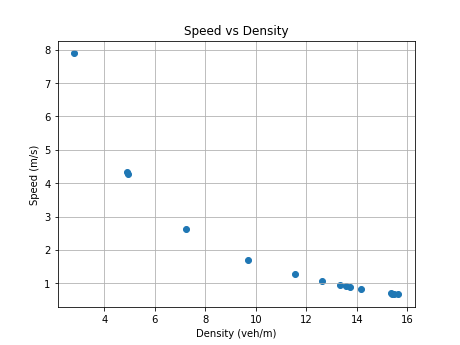

# Car following simulation

>📋  A reproducible project example featuring traffic simulation with car following models and fundamental diagrams.

# Reproducibility in Transportation Research Tutorial

This repository is the official implementation for the ITSC 2024 [Reproducibility in Transportation Research: A Hands-on Tutorial](https://rrintransportation.github.io/itsc24-rr-tutorial/), Session 2 on *Documentation of Data and Code for Reproducibility*.

>📋 See the website for the accompanying lecture notes to this example, including step-by-step guidance.

## Requirements

Install [Anaconda Python](https://www.anaconda.com/download).

>📋 **For Mac users with M1/M2 chips**: There are known issues with the "Apple Silicon" version of Anaconda. Please instead install the Intel version, even for M1/M2 chips. It is compatible for this project.

To install the Python requirements:

```setup
conda env create -f environment.yml
conda activate RR
```

## Run

To produce the fundamental diagrams in the tutorial, run this command:

```
python example/simulator.py --run-idm --no-render
```

The files are created under the `data` directory, and the figures under the `figures` directory.

To visualize the traffic simulation:
```
python example/simulator.py --run-idm
```

To save the traffic simulation into gif:
```
python example/simulator.py --run-idm --plot-gif
```

## Simulation Example

 

## Fundamental diagrams

The following are fundamental diagrams generated from single lane traffic modeled using the Intelligent Driver Model (IDM).

 



## Contributing

If you'd like to contribute, or have any suggestions for these guidelines, you can contact us at cathywu at mit dot edu or open an issue on this GitHub repository.

All contributions welcome! All content in this repository is licensed under the MIT license.